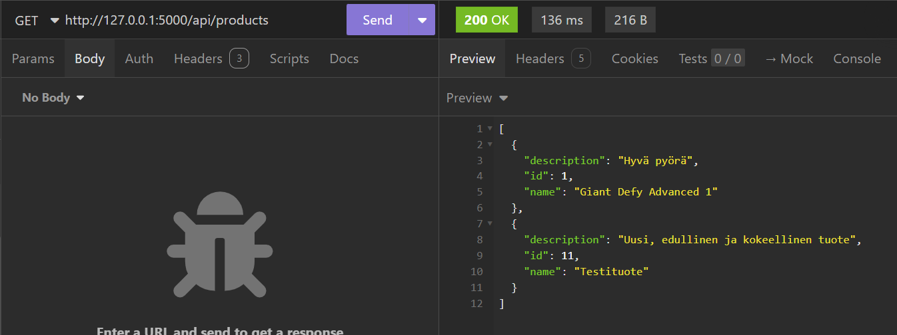

# Tehtävä 2 

## Esivaatimukset
Jotta ohjelma toimii, tarvitaan *sovelluskehykset_bad1*-niminen *MySQL*- tai *PostgreSQL*-tietokanta tai molemmat, joissa on taulut *users* ja *products*. *users*-taulussa on oltava sarakkeet *id* (PK, AI, NN, int), *username* (NN, varchar255), *firstname* (NN, varchar255) ja *lastname* (NN, varchar255). *products*-taulussa on oltava sarakkeet *id* (PK, AI, NN, int), *name* (NN, varchar255) ja *description* (text).

## Projektin konfigurointi Windows-käyttöjärjestelmällä
1. Kloonaa repositorio:
```
git clone https://peke.plab.fi/ilaurant/exercise2.git
```
2. Avaa projekti esim. *Visual Studio Codella*:
```
code exercise2
```
3. Luo vasemmassa laidassa näkyvän projektikansion tiedostopuun juureen *.env*-tiedosto. 
- Jos käytät ohjelmaa *PostgreSQL*-tietokannan kanssa, lisää tiedostoon alla olevat muuttujat. Jos muuttujassa on hakasulut, täytä niiden tilalle tietokantakohtaiset arvot:
```
DB=postgres
DB_NAME=sovelluskehykset_bad1
POSTGRES_USER=[kirjoita tähän PostgreSQL-tietokannan käyttäjä]
POSTGRES_HOST=localhost
POSTGRES_PW=[kirjoita tähän PostgreSQL-tietokannan salasana, jos sellainen on. Muussa tapauksessa kirjoita: ""]
```
- Jos käytät ohjelmaa *MySQL*-tietokannan kanssa, lisää tiedostoon seuraavat muuttujat:
```
DB=mysql
DB_NAME=sovelluskehykset_bad1
MYSQL_USER=[kirjoita tähän MySQL-tietokannan käyttäjä]
MYSQL_PW=[kirjoita tähän MySQL-tietokannan salasana, jos sellainen on. Muussa tapauksessa kirjoita: ""]
```
- Jos tietokannasta löytyy versio kummallakin tietokantaohjelmistolla, voi yllä olevat muuttujat lisätä samaan *.env*-tiedostoon. Poista silloin **toinen** *DB*-muuttuja. Jäljelle jäävän *DB*-muuttujan tilalle voi kirjoittaa sen tietokantaohjelmiston nimen, jota kulloinkin on tarkoitus käyttää. Poista tässä tapauksessa myös **toinen** *DB_NAME*-muuttuja.
- Tallenna muutokset.

3. Avaa terminaali, navigoi projektin juureen ja luo virtuaaliympäristö:
```
python -m venv venv
```
4. Käynnistä virtuaaliympäristö:
```
venv\Scripts\activate
```
5. Asenna riippuvuudet:
```
python -m pip install -r requirements.txt
```
6. Käynnistä sovellus:
```
python app.py
```
Käynnistä myös tietokanta, minkä jälkeen CRUD-operaatioita voi toteuttaa rajapintojen testaussovelluksella. Jos *DB*-muuttujan arvoa vaihtaa *.env*-tiedostossa, on ohjelma käynnistettävä uudestaan, jotta tietokantaohjelmiston vaihdos astuu voimaan.

## CRUD-operaatioiden testaaminen

GET-pyynnöt lähetetään seuraaviin endpointeihin:
- http://127.0.0.1:5000/api/users
- http://127.0.0.1:5000/api/users/{id} *
- http://127.0.0.1:5000/api/products
- http://127.0.0.1:5000/api/products/{id} *

POST-pyynnöt lähetetään seuraaviin endpointeihin:
- http://127.0.0.1:5000/api/users
- http://127.0.0.1:5000/api/products

PUT-, PATCH- ja DELETE-pyynnöt lähetetään seuraaviin endpointeihin:
- http://127.0.0.1:5000/api/users/{id} *
- http://127.0.0.1:5000/api/products/{id} *

*={id}:n tilalle syötetään valittu tunnus

*users*-tauluun kohdistuviin POST- ja PUT-pyyntöihin on liitettävä *JSON*-objektimuotoinen body, josta löytyvät avaimet "username", "firstname" ja "lastname" valittuine arvoineen. 

*users*-tauluun kohdistuviin PATCH-pyyntöihin on liitettävä *JSON*-objektimuotoinen body, jossa on avain "lastname" valitulla arvolla.

*products*-tauluun kohdistuviin POST- ja PUT-pyyntöihin on liitettävä *JSON*-objektimuotinen body, josta löytyvät avaimet "name" ja "description" arvoineen.

*products*-tauluun kohdistuviin PATCH-pyyntöihin on liitettävä *JSON*-objektimuotoinen body, jossa on avain "description" valitulla arvolla.

### Esimerkkejä

Esimerkeissä käytetään *PostgreSQL*-tietokantaa

Tuotteiden hakeminen:


Tuotteen lisääminen:


Tuotteiden hakeminen tuotteen lisäämisen jälkeen:



Tuotteen kaikkien tietojen muokkaaminen:


Tuotteen kuvaustiedon muokkaaminen:


Tuotteen hakeminen muokkausten jälkeen:


Tuotteen poistaminen:


Poistetun tuotteen hakeminen:


